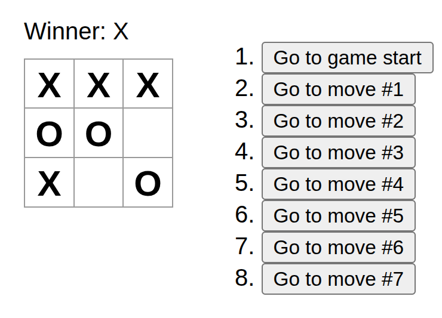

# React Tic Tac Toe

👋 Hello! In this project, I wanted to learn React because I wish to become a Full Stack developer (I already know DevOps and Backend). I followed the 'Learn React' tutorial on [react.dev](https://react.dev/learn) and built the popular tic-tac-toe game.



Through this project, I learned how React works, the importance of components for reusing code in applications, and about hooks like useState. 😁

## How to run:

```bash
git clone https://github.com/JoaoRobert0/React-Tic-Tac-Toe.git

cd ./React-Tic-Tac-Toe/

npm install

npm start
```

### Thank you!